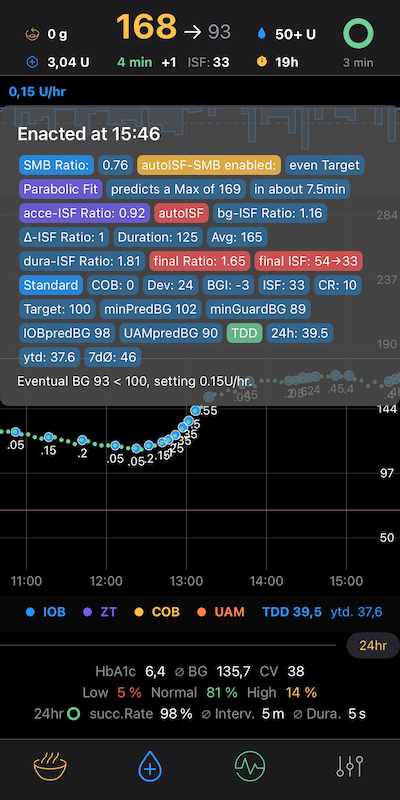
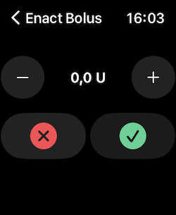

# FreeAPS-X autoISF Branch

## Introduction

FreeAPS-X - an artificial pancreas system for iOS developed by Ivan Valkou based on [OpenAPS Reference](https://github.com/openaps/oref0) algorithms.

FreeAPS-X uses original JavaScript files of oref0 and provides a user interface (UI) to control and set up the system. This branch includes autoISF to adjust ISF depending on 4 different effects in glucose behaviour that autoISF checks and reacts to:
* acce_ISF is a factor derived from acceleration of glucose levels
* bg_ISF is a factor derived from the deviation of glucose from target
* delta_ISF and pp_ISF are factors derived from glucose rise, 5min, 10min and 45min deltas and postprandial time frames
* dura_ISF is a factor derived from glucose being stuck at high levels

on iPhone 13 mini:

Apple Watch:

To use this branch :

git clone --branch=dev-aisf_TDD https://github.com/mountrcg/freeaps.git

The autoISF branch includes my implementation of autoISF by ga-zelle and some other extra features. autoISF is off by default.

Please understand that this version is :
- highly experimental
- not approved for therapy

# Changes

Latest version brings significant improvements for Omnipod Dash pumps and Dexcom G6 and G7sensors, Looping should be immediate and robust. Review in the Statistics Panel (see preferences).

## autoISF Version
* 2.2.8.1
	* dev release with current mods as of Mar 23, 2023
	* documentation at https://github.com/ga-zelle/autoISF

## Release
refers to FreeAPS-X which is currently mainly improved by Jon & Pierre at this [github repository](https://github.com/Jon-b-m/freeaps)
* 1.1.1
	* ExerciseMode calculation with InsulinRatio Slider
	* Tag changes in Popup
	* display ratio from TempTargets in InfoPanel
* 1.1.0
	* Meal presets
	* oref fixes
	* G7 smoothing
* 1.09
	* Allow to delete Carbs when connexion with NS is impossible - Alert the user of the issue. (#606), Pierre Avous.
	* Put back DASH strings deleted in Loop3 branch
	* Reverts oref0 commit. Scott Leibrand. Revert "fix(lib/iob): Move value checks up to index.js". Fix for too high predictions.
	* Synchronise upload readings toggle in dexcom settings with FAX settings (#608), Pierre Avous.
	* LibreView
* 1.08
	* Fat Protein conversions
	* AppleHealth Integration, good for manual BG values
	* fixes MDT and G6
* 1.07
	* Dash & G7 frameworks from Loop3
	* CoreData refactoring

## Remarks
Due to the heavy refactoring and my changes to Jon's CoreData, when moving from a version (below 1.07) to (1.07 or above) it is advised to delete FAX and install with a new clone. All current stats will be gone and build up again. All settings will be at default values, like `maxIOB = 0`. Due to deleting FAX you should do it in between pods, as you loose this information.

## Exercise Modes
Exercise Mode with high TT can be combined with autoISF. The Ratio from the TT, calculated with the Half Basal target, will be adjusted with the strongest (>1) or weakest (<1) ISF-Ratio from autoISF. This can be substantial. I myself prefer to disable autoISF adjustments while exercising, relying on the TT Ratio, by setting `Exercise toggles all autoISF adjustments off` to on.

# Documentation

Most of the changes are made in oref code of OpenAPS, which is part of FreeAPS-X. But it is not really readable in FAX, so refer to my [oref0-repository](https://github.com/mountrcg/oref0/tree/dev_aisf_TDD).

[Original autoISF implementation for AAPS](https://github.com/ga-zelle/autoISF)

[Discord FreeAPS-X ](https://discord.com/channels/1020905149037813862/1021578455839682560)

[Discord autoISF - FreeAPS-X channel](https://discord.com/channels/953929437894803478/1025731124615458848)

[FreeAPS-X original github](https://github.com/ivalkou/freeaps)

[ADD DASH PUMP and SETTINGS](https://loopkit.github.io/loopdocs/loop-3/omnipod/)

[Overview & Onboarding Tips on Loop&Learn](https://www.loopandlearn.org/freeaps-x/)

[OpenAPS documentation](https://openaps.readthedocs.io/en/latest/)
